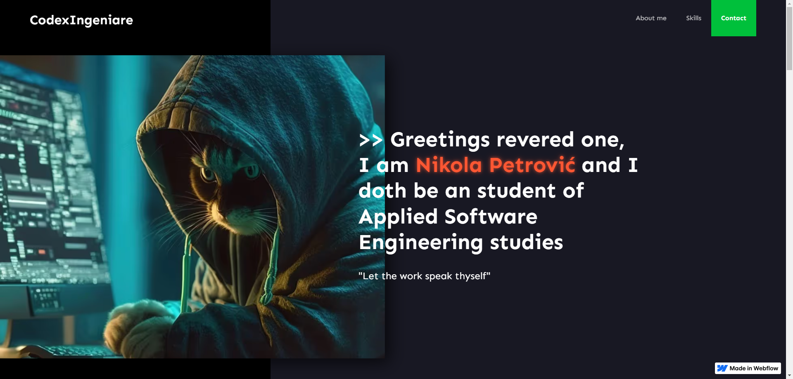
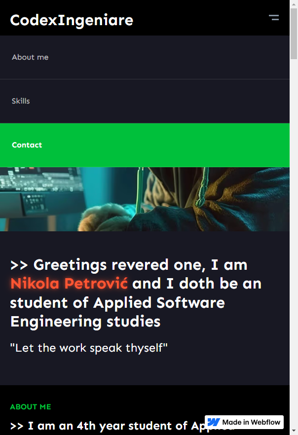
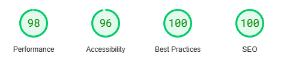

# Client Portfolio - Developed by Miloš 🎨

Welcome to the official portfolio website I designed and developed for **Codex Ingeniare**! This website was built using **Webflow** with custom code integrations, including **Typer.js** for dynamic text animation, a fully **responsive design**, and optimized for **SEO**. The goal was to create a visually engaging, user-friendly, and interactive online presence for client.

 

## Project Overview

This portfolio website showcases **Codex Ingeniare**'s work and services in a visually stunning and professional way. Through a combination of modern design techniques, animations (via **Typer.js**), and a mobile-first approach, the portfolio offers an engaging experience to users on all devices.

👉 [Explore this project](https://codexingeniare-portfolio.webflow.io/)

## Features 🎯

- **Interactive Hero Section**: Engaging **Typer.js** animation that highlights key aspects of the portfolio.
- **Responsive Design**: Optimized for smooth navigation on desktops, tablets, and mobile devices.
- **Clean & Modern Aesthetic**: Focused on showcasing the client’s work in a simple yet beautiful layout.
- **User-friendly Navigation**: Easy-to-use, intuitive menu and sections.
- **SEO Optimized**: Enhances discoverability on search engines.

## Technologies Used ⚙️

- **Webflow**: Used for the design and hosting of the website.
- **HTML/CSS**: Custom code to structure the layout and add custom styling.
- **JavaScript**: For dynamic elements, including the **Typer.js** animation.
- **Figma**: Used for the wireframing and prototyping phase.

## Responsive Design 📱

The portfolio features a **responsive design** that ensures a seamless experience across various screen sizes. The layout adjusts fluidly, keeping the content visually appealing and functional on devices ranging from large desktop screens to small mobile devices.

 

</img>

## Performance ⚡

- **Fast Load Times**: Optimized images and assets for quick page loads.
- **Browser Caching**: Ensures faster subsequent visits.
- **Lazy Loading**: Efficiently loads images as users scroll, reducing initial load times.

## SEO 📈

SEO best practices were implemented to enhance the visibility of the portfolio:

- **Optimized Meta Tags**: Improved for search engine indexing.
- **Responsive Design**: Ensures compatibility across devices, a key factor for SEO ranking.
- **Alt Text for Images**: Descriptive text added for better indexing by search engines.

## Website Score
The portfolio website has been tested using **Google PageSpeed Insights** to ensure optimal performance, accessibility, and user experience. Here are the highlights:

 

</img>

## Contact 📬

Interested in collaborating or need more information? Reach out via the following:

- **Email**: milosstankovic2002@gmail.com
- **LinkedIn**: [Connect with me on LinkedIn](https://www.linkedin.com/in/milo%C5%A1-stankovi%C4%87-6b3865186/)

Thank you for checking out this project!

---

